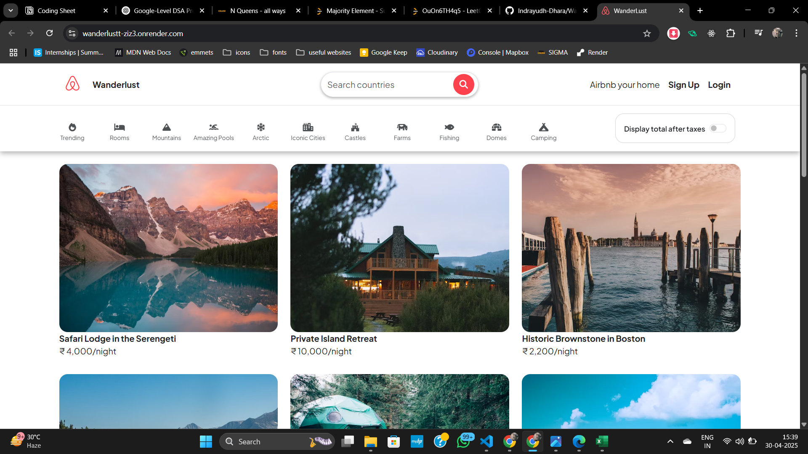

# 🏡 Wanderlust – Airbnb-Inspired Full-Stack Web App
[](https://wanderlustt-ziz3.onrender.com)  > ⚠️ First-time load might take a few seconds due to Render’s free-tier cold start.

Wanderlust is a full-stack web application inspired by Airbnb, built using the MERN stack. It allows users to explore, create, and manage listings for rental properties. The app features user authentication, image uploads, interactive maps, and a responsive UI — all designed to deliver a smooth and intuitive user experience.

---



## 🛠️ Tech Stack

**Frontend:**
- HTML, CSS, EJS (Embedded JavaScript Templates)
- Bootstrap 5

**Backend:**
- Node.js
- Express.js

**Database:**
- MongoDB
- Mongoose

**Authentication & Sessions:**
- Passport.js (Local Strategy)
- Express-Session
- Connect-Mongo

**Image Handling:**
- Multer (for file uploads)
- Cloudinary (for image storage)

**Other Tools:**
- Dotenv
- Cookie-Parser
- Connect-Flash (for alerts & messages)
- Mapbox (for interactive maps)

---

## ✨ Features

- 🔐 User Registration & Login with password hashing (Passport.js)
- 🧭 Location-based Listings with Mapbox
- 🖼️ Secure Image Uploads via Cloudinary
- 📝 Add, Edit, and Delete Listings
- 💬 Flash messages for success and error feedback
- 📱 Fully responsive UI with mobile support

---

## 🧑‍💻 Getting Started

### 1. Clone the Repository
```bash
git clone https://github.com/Indrayudh-Dhara/Wanderlustt.git
cd Wanderlustt
